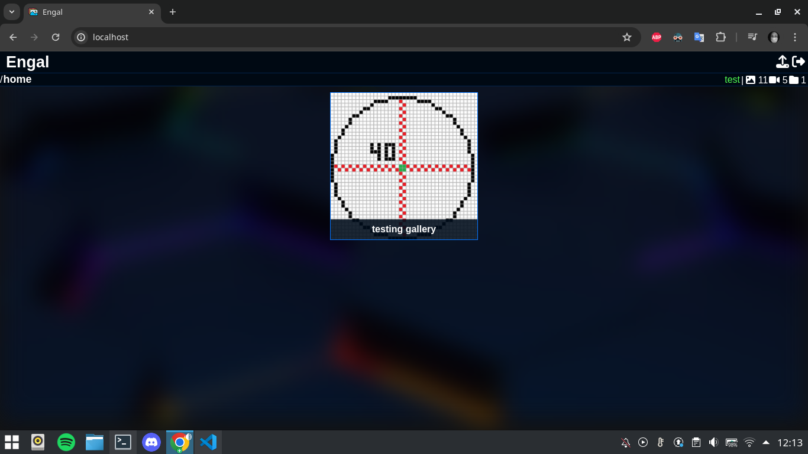
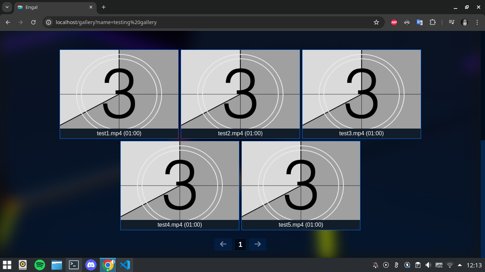

# Engal
Self-hosted encrypted media cloud storage.

> [!WARNING]
> ### End of support
> This project will no longer be updated or maintained.

## Gallery list

## Gallery browser

## Backend API
Engal backend is a REST API built with the Symfony framework. When running in the dev environment, you can use NelmioApiDoc for documentation and testing the API at the route `/api/doc`. The API is used for getting and uploading media files, creating galleries and accessing them. User login is based on JWT tokens through LexikJWT and Symfony Security Bundle.

## Frontend
The frontend is a React app that communicates with the REST API configured during the initialization of the application.

## Installation
The entire installation in the dev environment can be run through the `install.sh` script and launched using Docker Compose.

## License
The project is open-sourced software licensed under the [MIT license](https://github.com/lukasbecvar/engal/blob/main/LICENSE).
